# How to Become a Forecaster in an Hour ☁️🌡️
By: Ty Janoski, Ph.D.
Rutgers University
April 28th, 2026

---

## A bit about myself...
- Born \& raised in Wayne, NJ
- Always been interested in the weather
- Originally wanted to be a TV meteorologist
- Excited to be up in New Hampshire!

**Two events in high school sealed the deal for me**

---

### \#1: Hurricane Irene

<!-- footer: "" -->

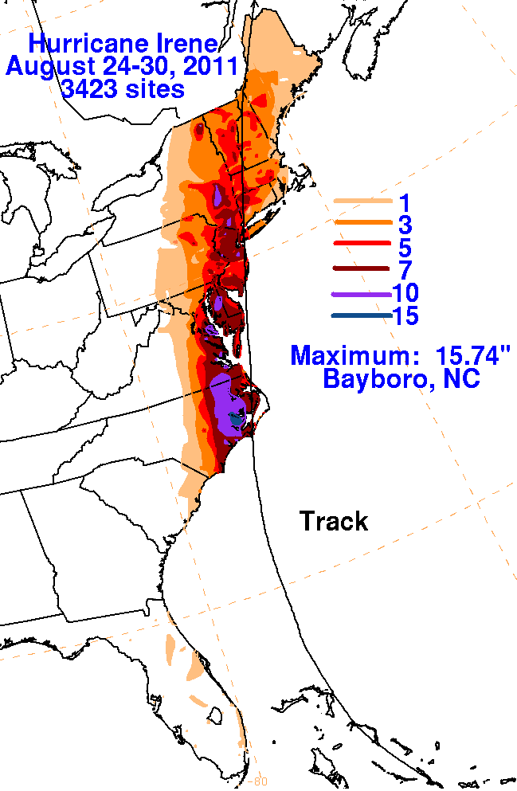

- August 28-29, 2011
- Wayne got \> 10" of rain
- Record-breaking Passaic river flooding
- Vermont was hit even harder — record river flooding cut off entire towns

  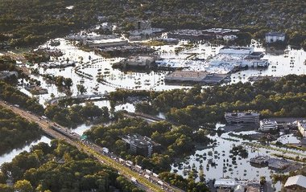
  
<small><small>Willowbrook Mall, August 2011</small></small>

---

### \#2: Hurricane Sandy

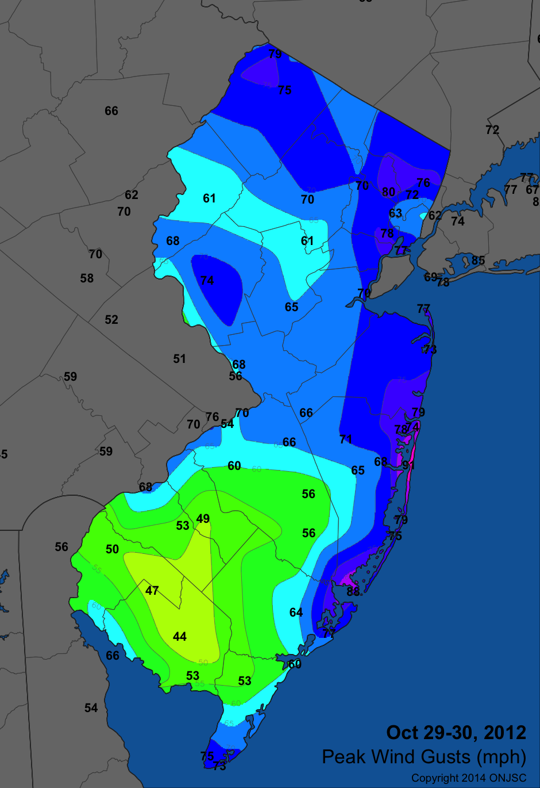

- Unique "left hook" into NJ
- Power outages for weeks
- Up to 9 feet storm surge in NJ
- Storm surge also impacted coastal Connecticut, Rhode Island, and Massachusetts

---

## Academic Journey: Undergrad → Grad School
- B.S. in **meteorology** and **marine science** at Rutgers (2017)
  - Undergraduate research with NOAA lab in Princeton — snowfall changes with increasing CO2
- Ph.D. in Earth \& Environmental Sciences, Columbia University (2024)
  - Studied **polar amplification** and its connections to extreme weather

---

## Now: Postdocs & Current Research
- Postdoc at CUNY City College of New York / NOAA NSSL
  - Studied **extreme rainfall** from Hurricane Ida (2021) — NYC got **\> 4" of rain in an hour**!
- Now at **Rutgers**: New Jersey's **power grid resilience** to extreme weather
  - How do floods, heat waves, and ice storms stress the power system?

---

## Fact: Forecasting is Important

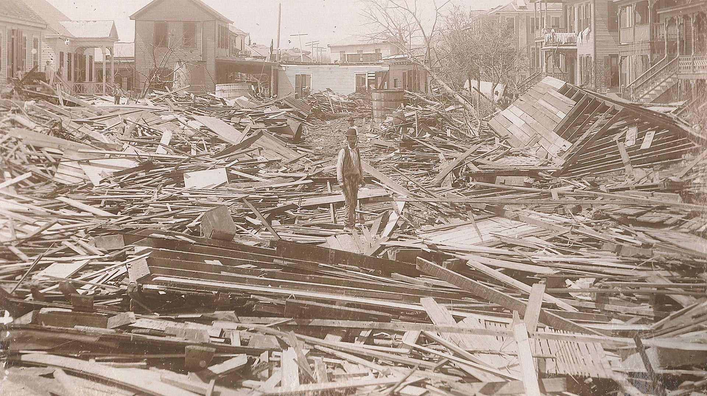

- We take weather forecasts for granted
- Consider the state of affairs *before* we had weather forecast access 24/7 on our phones
- Example: Galveston Hurricane of 1900
  - **Deadliest natural disaster in US History**
  - 6,000 - 12,000 fatalities
  - Forecast that day: "Rain Saturday, with high northerly winds; Sunday rain, followed by clearing."

---

## Forecasting basics
The modern challenge: **so much data**. How do we make sense of it all?

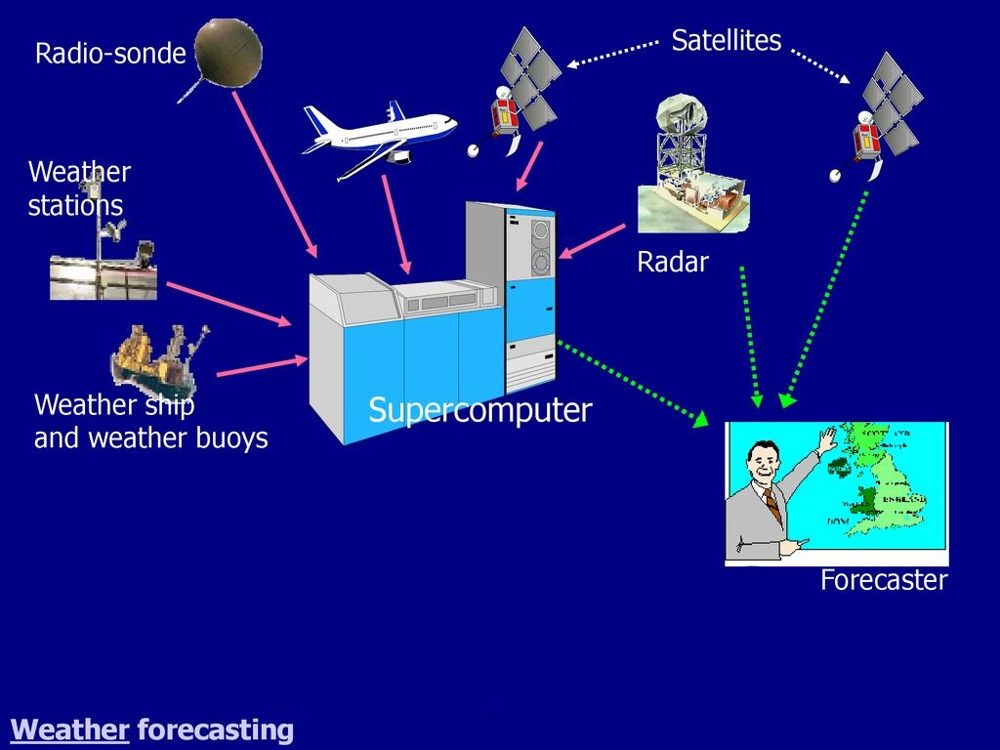

---

## Learning Objectives

**By the end of this lecture, you will be able to:**
- Access and interpret some of the most common observational data in meteorology
- Understand how weather models use this data to generate a forecast simulation
- Have the tools to create your own weather forecast

---

## Radar

- Radar stands for **Ra**dio **D**etection **A**nd **R**anging
- Useful for finding **precipitation**
- Real-time data with **high spatial and temporal resolution**

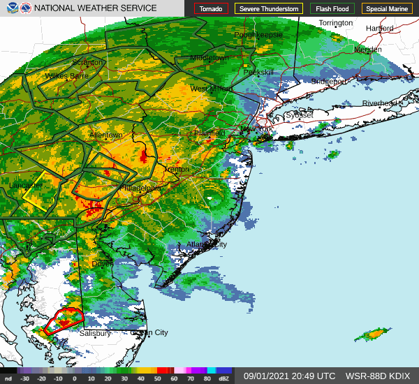

---

## Radar Basics

1. Radar sends out a pulse of energy
2. Energy bounces off objects in atmosphere and returns to radar
3. Radar detects the **strength** and **timing** of return

---

  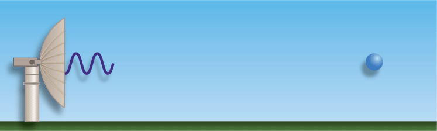
  
<small><small>Source: NOAA</small></small>

Keep in mind: the radar is rotating at different angles to sample the whole sky!

---

## Key Radar Quantities
- Three important quantities from radar:
    - **Reflectivity**: How much energy is bouncing back to the radar
    - **Time delay**: How long it takes for the energy to bounce back
        - **Shorter time delay = closer to the radar**
    - **Elevation angle**: The angle at which the radar is pointing
        - **⬇️ elevation angle = closer to the ground**

---

  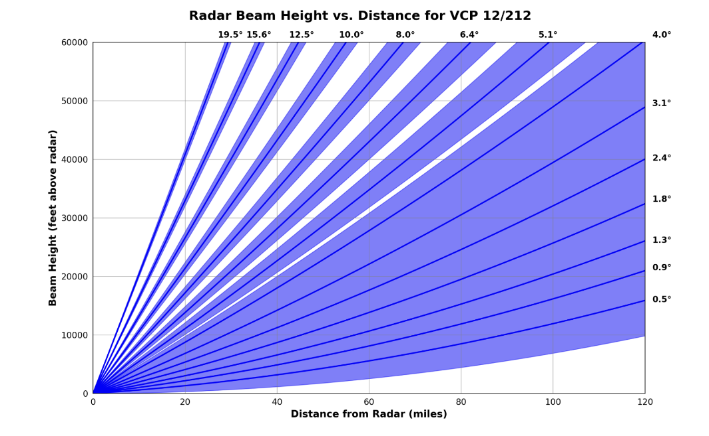
  
<small><small><em>Source: NOAA</em></small></small>

---

### More Radar Features:
- dual polarization to detect precipitation type ❄️☔
- doppler velocity for radar-relative motion 🌪️

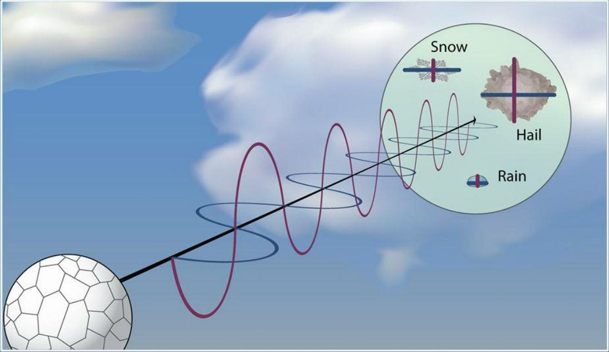

---

## Radar resources \& demo

- [NOAA NWS Radar](https://radar.weather.gov) (official site)
- [MRMS](https://mrms.nssl.noaa.gov/qvs/product_viewer/) (radar data archive \& advanced products)
- [Iowa State IEM](https://mesonet.agron.iastate.edu/radar/) (**archived radar**, surface obs \& soundings — great for past events)
- [College of DuPage](https://weather.cod.edu/satrad/) (satellite + radar together)
- [NWS Burlington](https://www.weather.gov/btv/) (great for northern New England)
- RadarScope app is excellent but unfortunately not free

---

## Satellite basics
- Take measurements of the atmosphere from space
- Weather satellites normally observe the **brightness of Earth's atmosphere** in specific wavelength bands
  - They **do not** directly measure temperature or water vapor—just radiation
- Often our *only* source of data in remote parts of the world

---

  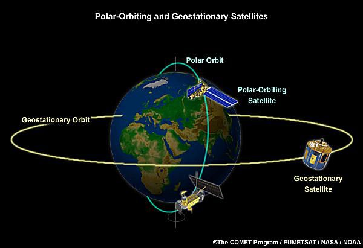
  
<small><small><em>Source: ThoughtCo</em></small></small>

  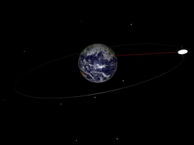
  
<small><small><em>Source: Wikimedia Commons</em></small></small>

---

## Question: How far away are geostationary satellites from Earth?
- A) 200 miles
- B) 2,000 miles
- C) 20,000 miles
- D) 200,000 miles

---

## Types of satellite imagery
- **Visible Imagery**: shows reflected sunlight (**day only**)
  - Great for clouds and surface features
- **Infrared (IR) Imagery**: shows cloud-top temperatures
    - Can see cloud tops and motion **day or night**
- **Water Vapor Imagery**: measures wavelengths absorbed by water vapor **day or night**
    - Great for finding cyclones, dry slots, atmospheric rivers, etc.

---

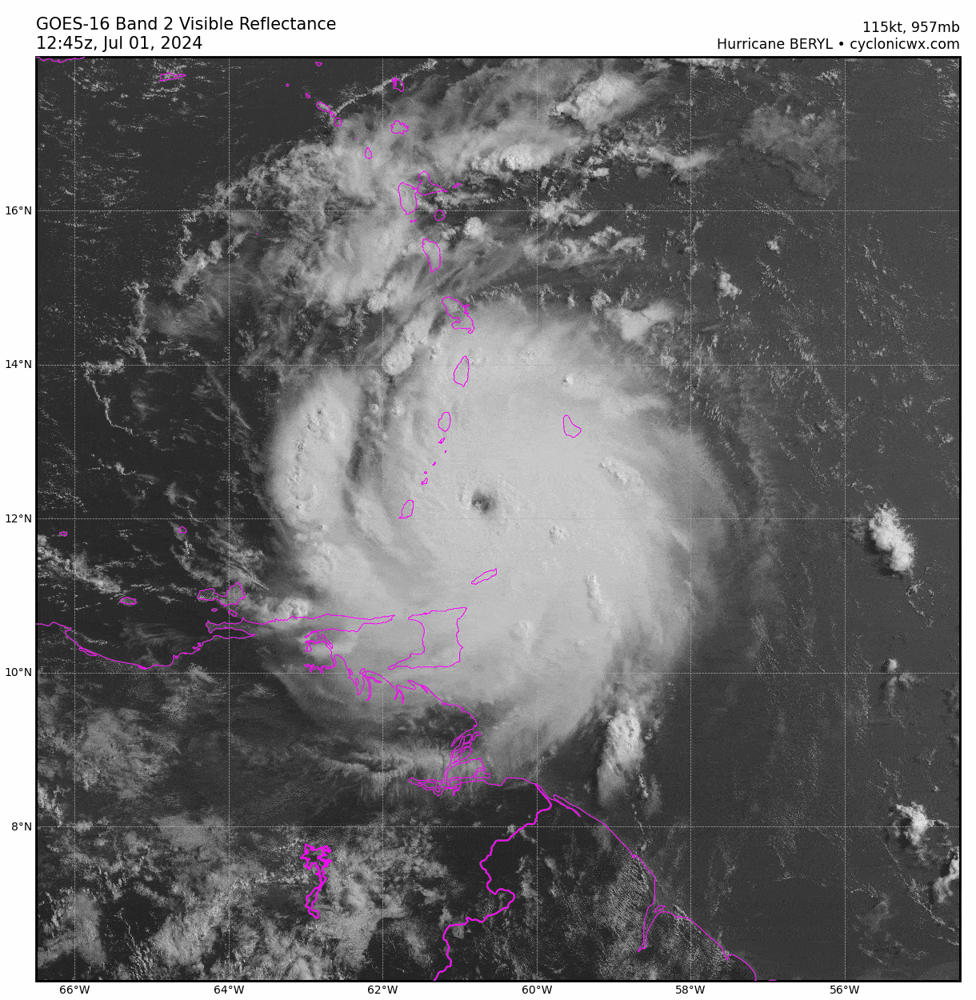

## Visible imagery
**Light colors**: thick clouds, snow

**Dark colors**: clear skies

---

## Infrared imagery
- Different colors = different temperatures
- Colder temps = higher clouds = red/white
- Warmer temps = lower clouds = blue/green

  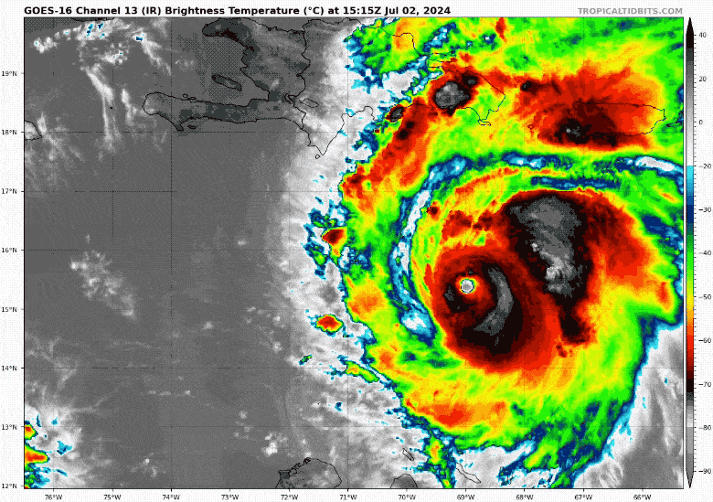
  
<small><small><em>Source: Just In Weather</em></small></small>

---

## Water vapor imagery
- Different colors = different moisture levels
- White, blue, and green = moist air
- Yellow, orange, and red = dry air

  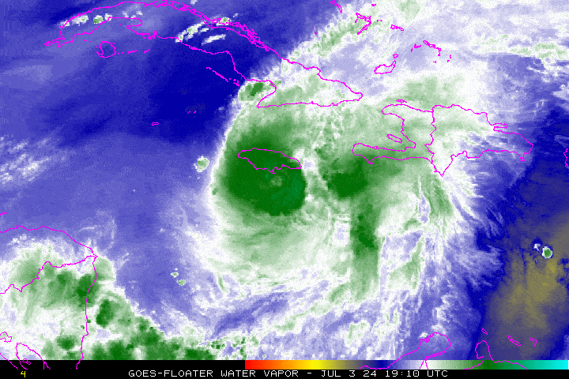
  
<small><small><em>Source: Just In Weather</em></small></small>

---

## Satellite Resources \& Demo
- [NOAA GOES Image Viewer](https://www.star.nesdis.noaa.gov/GOES/index.php) (Official NOAA source)
- [CSU RAMMB Slider](https://rammb-slider.cira.colostate.edu) (Multiple satellite, last 20 days)
- [College of DuPage](https://weather.cod.edu/satrad/) (satellite + radar together)
- [NASA Worldview](https://worldview.earthdata.nasa.gov/) (global satellite data but hard to use tbh)

---

## Upper air observations
- Measurements taken directly from the atmosphere
- Essential for understanding the vertical structure of the atmosphere and predicting weather
- Collected via weather balloons (radiosondes) and aircraft
- Radiosondes measure temperature, humidity, pressure, and wind speed/direction
- Data is sent back to the ground via radio

---

## Reading upper air observations
- Show vertical profiles of temperature, moisture, and wind
  - **Temperature**: red line
  - **Dew point**: green line
  - **Wind speed**: barbs
  - **Wind direction**: direction **from which** wind blows
- Temperature and dew point are close = clouds (usually)!
- Temperature increases with height = inversion

---

## Example: Grey, ME

  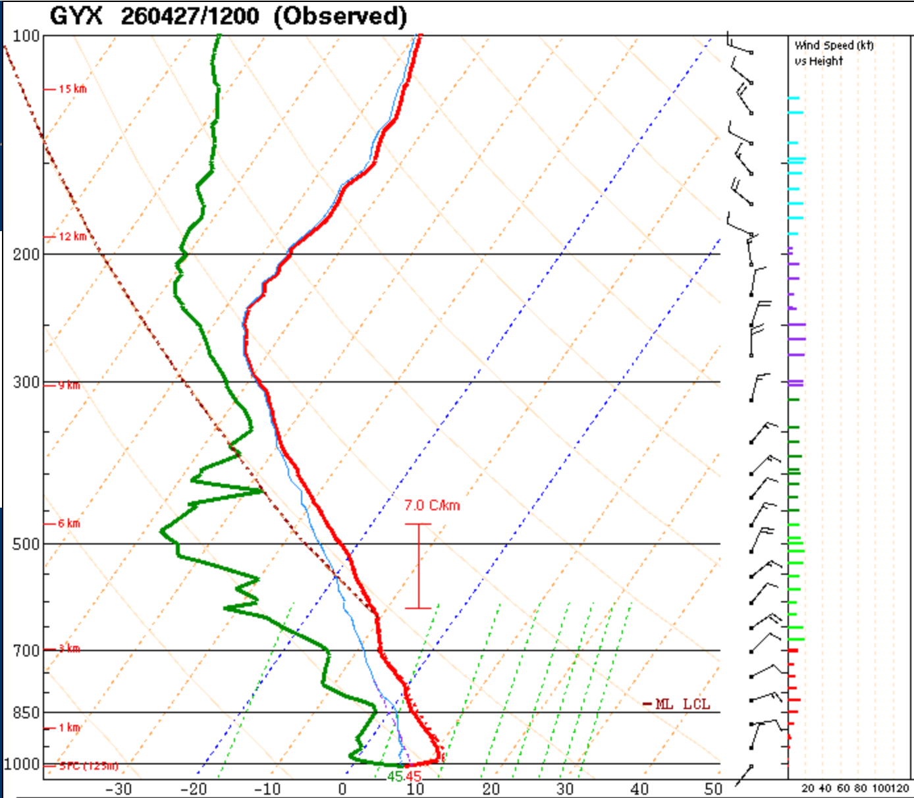
  
<small><small><em>Source: University of Wyoming</em></small></small>

---

## Upper-air maps

Data from soundings ➡️ upper-air maps on pressure levels to show us the flow of the atmosphere

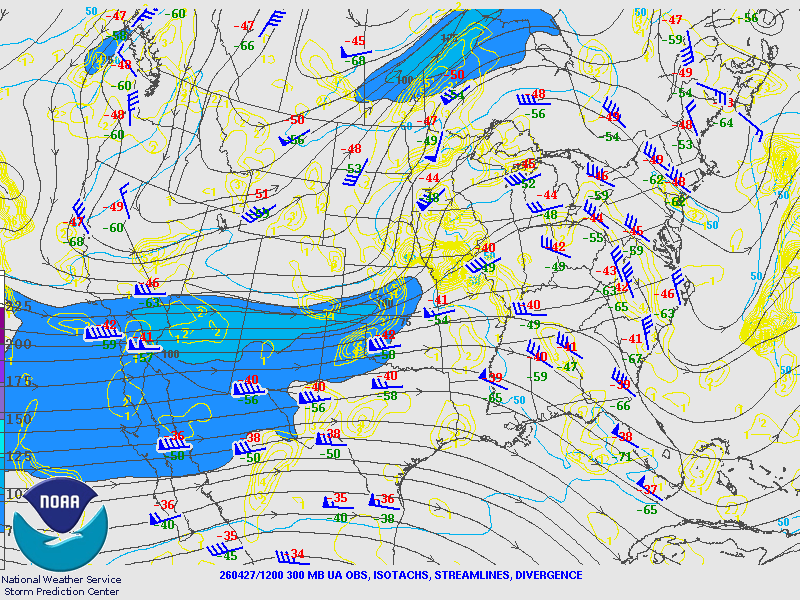

---

## Upper Air Resources \& Demo
- Soundings:
  - [NWS Storm Prediction Center](https://www.spc.noaa.gov/exper/soundings/) (Official NOAA source, tons of data)
  - [University of Wyoming](https://weather.uwyo.edu/upperair/sounding.html) (Great for past soundings)
- Upper air maps:
  - [NWS Storm Prediction Center](https://www.spc.noaa.gov/obswx/maps/) (A bit ugly)
  - [Mountain Weather](https://www.mountainweather.com/weather-maps/upper-air-maps/) (Clear analyses)

---

## Surface observations basics
- Measurements taken at the Earth's surface
- Collected via:
    - Automated weather stations
    - Manual observations
    - Ships and buoys
- Record temperature, moisture, cloud cover, current weather

---

## Station symbols

- Surface observations are plotted on a map using station symbols

  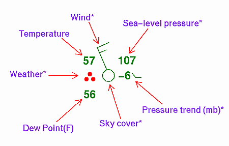
  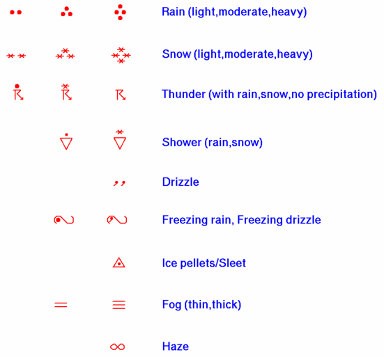

<small><small><em>Source: NOAA WPC</em></small></small>

---

## Surface map analyses - Fronts and symbols

  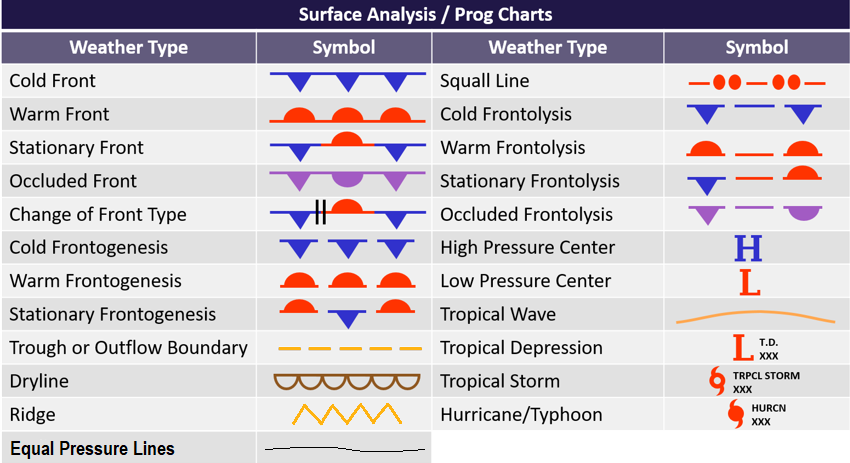
  
<small><small><em>Source: Aviation Weather</em></small></small>

---

## <small>Nor'easter Example: January 2026 </small>

  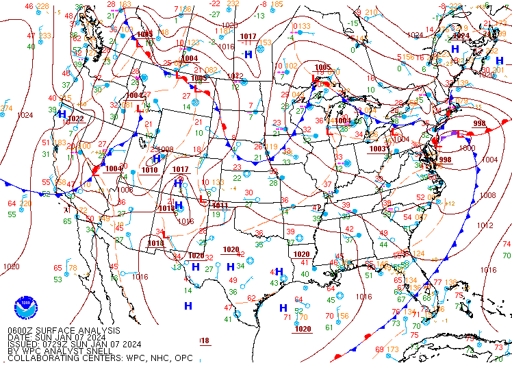
  
<small><small><em>Source: NOAA WPC</em></small></small>

 

---

## Surface Analysis Resources \& Demo

- [NOAA Weather Prediction Center](https://www.wpc.ncep.noaa.gov/html/sfc-zoom.php) (archived every three hours)
- [NWS Burlington](https://www.weather.gov/btv/) (NH/VT coverage \& observations)
- [College of DuPage](https://weather.cod.edu/analysis/) (click on Surface Maps)
- [NWS Boston](https://www.weather.gov/box/) (southern New England)

---

## What are weather forecast models?
- Numerical Weather Prediction (NWP) models simulate the atmosphere with math \& physics
- **Input**: All the data we've discussed so far, past model runs (sometimes)
- **Output**: Predicted atmospheric conditions (temperature, precipitation) at future times

---

## How do NWP models work?
1. **Data collection**: Gather data from satellites, weather stations, balloons, etc.
2. **Data assimilation**: Combine observations with model data to create a starting point for the model
3. **Model integration**: Solve equations of motion, thermodynamics, moisture, etc. *forward in time*
4. **Post-processing**: Transform model output into usable information

---

## Global vs. Regional Models

| | **Global** | **Regional** |
|---|---|---|
| **Coverage** | Entire globe | Smaller areas |
| **Frequency** | Every 6–12 hours | More frequent |
| **Forecast range** | Up to 16 days | 3–5 days |
| **Examples** | GFS, ECMWF | NAM, HRRR, WoFS |

---

## Why aren't forecasts from models perfect?
- **Observations are not perfect**
    - Missing data, errors, spotty coverage...
- **Physical equations are not perfect**
    - Simplifications, approximations, parameterizations...
- Computational limits and rounding errors affect precision
  - Butterfly effect

---

## Example: Convective parameterization
- A typical thunderstorm ➡️ ~15 miles diameter
- GFS (American) model ➡️ ~ 18 mile grid spacing
  **Problem: Model too coarse to *explicitly resolve* individual thunderstorms**

**Parameterization**: represent small-scale processes with simplified equations and estimates

---

#### Example of Forecast Spread: Spaghetti Plot

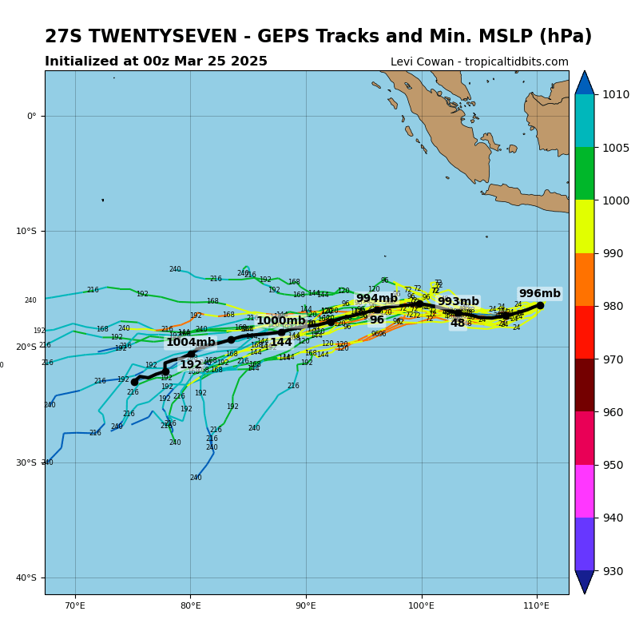

---

## Using model output
- U.S. weather models available for free
- Advanced tools sometimes behind paywall
  - Create soundings, take cross-sections, apply fancy algorithms
- **Do not put all your eggs in one forecast model basket!**

---

## Forecast model resources
- [NOAA Model Analysis and Guidance (MAG)](https://mag.ncep.noaa.gov/)
- [Tropical Tidbits](https://www.tropicaltidbits.com/) (easy interface, lots of models)
- [Pivotal Weather](https://www.pivotalweather.com/) (beautiful visualizations, some paid features)
- [College of DuPage](https://weather.cod.edu/forecast/)
- [NOAA NSSL Warn-on-Forecast System](https://cbwofs.nssl.noaa.gov/forecast) (high-resolution, only run some days)
- Lots of apps!

---

### Building a forecast

- **Start globally to forecast locally**
- **Global-scale** phenomena
  - Ex: Satellite data ➡️ global flow, upper air observations ➡️ jet stream
- **Synoptic-scale**
  - Fronts, high/low pressures, radar data ➡️ precip
- **Mesoscale/Local Scale**
  - Surface observations, convective quantities

---

## Snellman Funnel

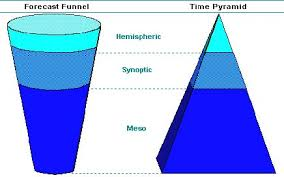

---

### My approach for New England forecasting
<small>

1. Look at global/CONUS satellite imagery.
2. Check out jet stream with upper air maps.
3. Start looking at synoptic features with radar, surface analyses, and surface observations.
4. (Optional) Look at "special" (severe, winter, nor'easter) weather fields.
5. Observe local conditions in New England.
6. Consult appropriate forecast models.
7. Make forecast narrative for time period of interest.
8. **Verify your forecast!**

</small>

---

### Forecasting resources
- [Storm Prediction Center](https://www.spc.noaa.gov/)
- [NOAA Weather Prediction Center](https://www.wpc.ncep.noaa.gov/)
- [NWS Forecast Points](https://www.weather.gov/forecastpoints)
- [Ventusky](https://www.ventusky.com/)

---

### Conclusions
- Forecasting requires data, models, and experience.
  - Don't fall for data overload. Stick with the basics.
- Satellite, radar, upper air, and surface observations are all useful tools that give us different information.
- Forecast models are our most powerful tools but need to be used judiciously.
- Practice as much as you can, but keep it fun 😄.

---

### Additional Learning Resources

- [NOAA Jetstream](https://www.weather.gov/jetstream/)
- [Comet MetEd](https://www.meted.ucar.edu/)
- [Other NWS Educator Resources](https://www.weather.gov/owlie/educate)
- Reach out if you want to chat more about meteorology, research, or grad school!

---

Thank you! I'm happy to talk about meteorology, graduate school, research, jobs, etc.

📧: [tyler.janoski@rutgers.edu](mailto:tyler.janoski@rutgers.edu)
